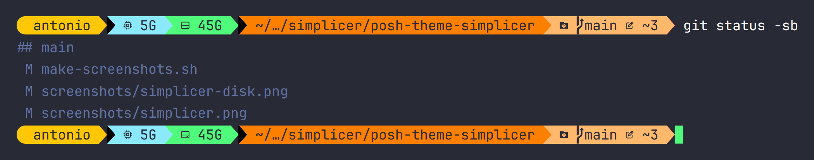
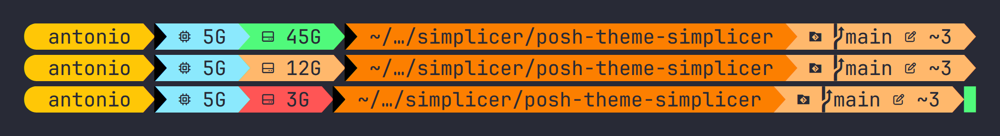

# simplicer

A single-line oh-my-posh prompt that shows the four things I check all day:
free memory, free disk, where I am, and what git is doing with the repository.



## Segments

| Segment | What it shows | When it changes colour |
| --- | --- | --- |
| user | your login name on a yellow cap | never |
| memory | free RAM in GB | orange above 70% used, red above 85% |
| disk | free space on `/` | green above 15 GB, orange below 15, red below 5 |
| path | the last two folders of the working directory, the rest collapsed | never |
| git | branch, ahead/behind, unstaged, staged, stashes | see below |



The git block is the busy one: orange while you have local edits, cyan when you
are ahead of the upstream, violet when you are behind, red when both at once.
Local edits win over the ahead/behind colours, and green means clean and in
sync.

Colours come from the [Dracula palette], so it sits next to a Dracula terminal
theme without arguing with it.

## Requirements

- [oh-my-posh] installed, tested against 31.3.0.
- A [Nerd Font] patched into your terminal, otherwise the icons render as boxes.
- A POSIX system with `df` for the disk segment. On Windows that segment simply
  hides itself instead of printing an error.

Nothing goes in your shell profile beyond the `oh-my-posh init` line. The theme
reads the disk by itself, so there is no `PROMPT_COMMAND` hook and no extra
environment variable to maintain.

## Install

Grab the file:

```bash
mkdir -p ~/.config/oh-my-posh/themes
curl -o ~/.config/oh-my-posh/themes/simplicer.omp.json \
  https://raw.githubusercontent.com/simplicer/posh-theme-simplicer/main/simplicer.omp.json
```

Then point your shell at it.

```bash
# bash, ~/.bashrc
eval "$(oh-my-posh init bash --config ~/.config/oh-my-posh/themes/simplicer.omp.json)"
```

```zsh
# zsh, ~/.zshrc
eval "$(oh-my-posh init zsh --config ~/.config/oh-my-posh/themes/simplicer.omp.json)"
```

```fish
# fish, ~/.config/fish/config.fish
oh-my-posh init fish --config ~/.config/oh-my-posh/themes/simplicer.omp.json | source
```

I suggest downloading the file instead of pointing `--config` straight at the
raw GitHub URL: the disk segment uses the `cmd` template function, and themes
that run commands are only meant to come from sources you trust.

## Changing the thresholds

The disk limits are the two `background_templates` entries of the block with
the hard-drive icon. Both compare free gigabytes against a number: `5` for red,
`15` for orange. Change those two integers and nothing else.

The memory limits are one block above, expressed as percentages of
`PhysicalPercentUsed`, and follow the same idea (`70` and `85`).

## Credits

Built on the segment work in [oh-my-posh] by Jan De Dobbeleer and
contributors. This started out as a personal config called `nicomaco`; the
name changed, the segments did not.

## License

[GNU General Public License v3.0](LICENSE).

[Dracula palette]: https://draculatheme.com
[oh-my-posh]: https://ohmyposh.dev
[Nerd Font]: https://www.nerdfonts.com
